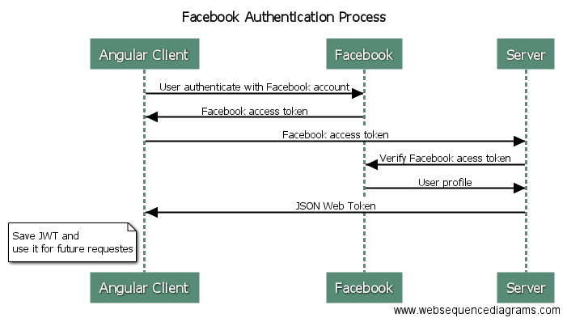

# Facebook Passport

- When users want to register for our application, they will click the “Signup with Facebook”. 

- When the button is clicked, our client application will request an access token from Facebook. 

- Then, the user will be presented with a dialog to allow the application to access some of their Facebook data.

- If the user gives their permission, our client application will "get the Facebook access token in response".

- At this moment we can access user data from the client application, but "an account is not yet created" at our backend.

- In order to create new user account, our client application "sends a request to our backend with the Facebook access token".

- The backend needs to verify the Facebook access token, so it is "sends a verification request directly to Facebook".

- If the Facebook token is valid, the Facebook server will "send user data back to our application".

- Upon receiving this data, the backend server has verified that the user credentials are valid and will create a user profile in our application "with data received from Facebook".

- After that, the backend needs to "create a JSON Web Token (JWT)" which will be used to "identify the user".

- This token is then sent in a response to the client application. 

- The client application will "receive JWT and save it for further use".

- Every "request that goes to the backend server" should "contain a JWT" which uniquely identifies the user.